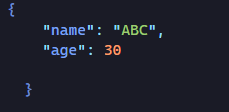
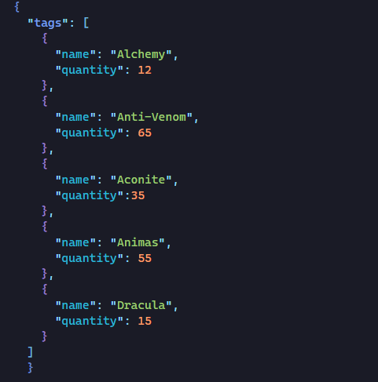
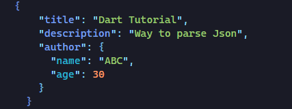
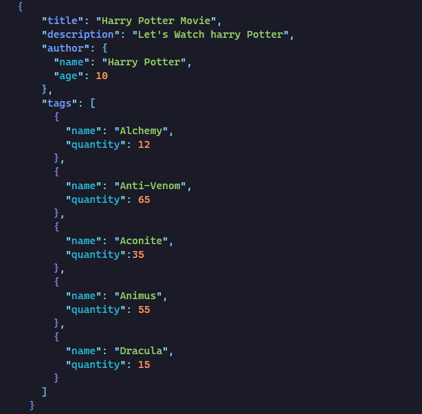
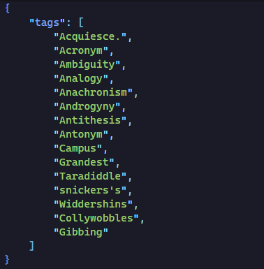
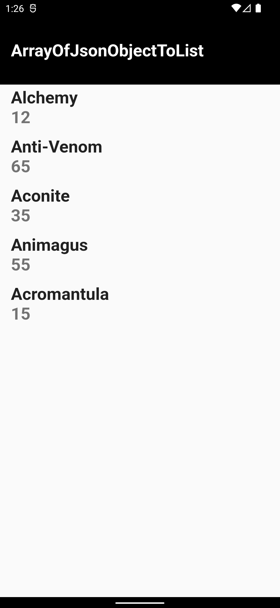
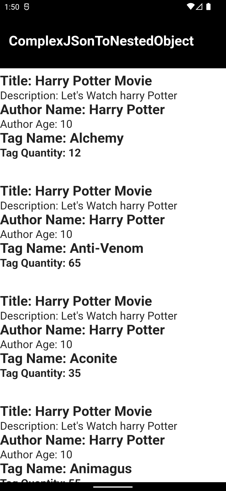
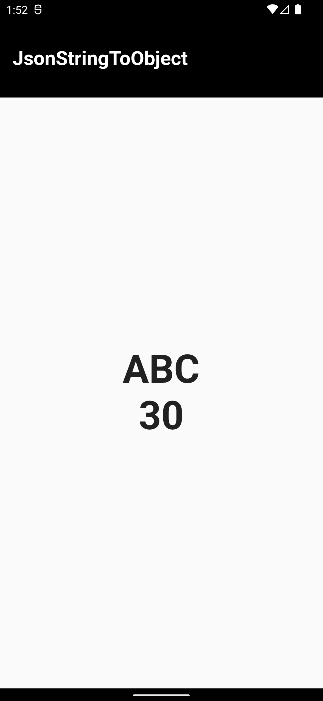

# Parsing JSON in Flutter

This project show how to parse and display different type of JSON inside flutter app.
It does not just include print statement inside terminal it include how to implement inside the flutter app.

# JSON

#### Json String to Object

#### Array of JSON objects into List

#### JSON string into Nested Object

#### Complex JSON into Nested Object

#### JSON array into List

# App View

  
  
  
  
  

